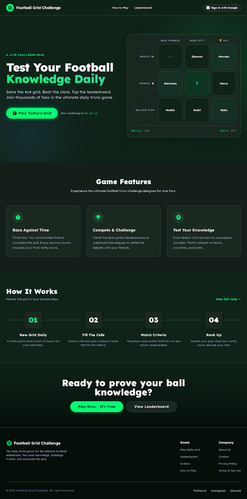

# Kickle

The daily football grid puzzle that tests your squad knowledge.

## About

Kickle is a daily football trivia game where players match footballers across club and country criteria in a 3x3 grid. Think Wordle, but for football fans.




## Tech Stack

- **Framework:** Next.js 15
- **Styling:** Tailwind CSS
- **Language:** TypeScript
- **Deployment:** Vercel (planned)

## Current Status

**In Development**
- Landing page complete
- Game logic in progress
- Player database pending
- Daily challenge system planned

## Getting Started

```bash
# Install dependencies
npm install

# Run development server
npm run dev
```

Open [http://localhost:3000](http://localhost:3000) to see the app.

## Features (Planned)

- Daily football grid challenges
- Player statistics tracking
- Leaderboard system
- Share results with friends
- Google authentication

## Contributing

This is a personal project, but feedback and suggestions are welcome!

## License

MIT

---

Made for football fans everywhere