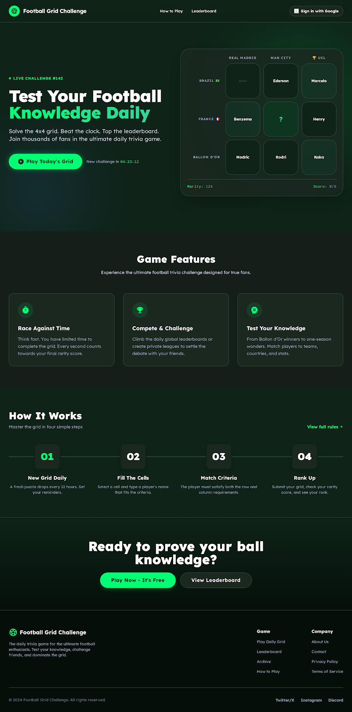

# Kickle

The daily football grid puzzle that tests your squad knowledge.

## About

Kickle is a daily football trivia game where players match footballers across club and country criteria in a 3x3 grid. Think Wordle, but for football fans.




## Tech Stack

- **Framework:** Next.js 15
- **Styling:** Tailwind CSS
- **Language:** TypeScript
- **Deployment:** Vercel (planned)

## Current Status

**In Development**
- Landing page complete
- Game logic in progress
- Player database pending
- Daily challenge system planned

## Getting Started

```bash
# Install dependencies
npm install

# Run development server
npm run dev
```

Open [http://localhost:3000](http://localhost:3000) to see the app.

## Production domain

The canonical production URL is `https://playkickle.online`; `https://www.playkickle.online` is also accepted for authentication. In Vercel, add both domains to the project and set these production environment variables:

```bash
BETTER_AUTH_URL=https://playkickle.online
NEXT_PUBLIC_BETTER_AUTH_URL=https://playkickle.online
NEXT_PUBLIC_SITE_URL=https://playkickle.online
BETTER_AUTH_TRUSTED_ORIGINS=https://playkickle.online,https://www.playkickle.online
```

In the Google Cloud OAuth client, add `https://playkickle.online/api/auth/callback/google` as an authorized redirect URI. If you configure Google to return through `www`, also add `https://www.playkickle.online/api/auth/callback/google`.

## Daily Grid Automation

The app now includes a shared daily-grid creator that can be triggered in three ways:

```bash
# Run the midnight job once from the command line
npm run cron:grid

# Manually seed a grid for debugging/backfills
npm run seed:grid
```

### Cron endpoint

You can also hit the protected endpoint:

- `GET /api/cron/grid`
- `POST /api/cron/grid`

It accepts either the `x-vercel-cron` header, or a `CRON_SECRET` bearer token / query string secret.

### Environment

Set `GRID_TIMEZONE` to the timezone you want the daily grid to follow. If you schedule the job at local midnight, use the same timezone in your scheduler.

## Features (Planned)

- Daily football grid challenges
- Player statistics tracking
- Leaderboard system
- Share results with friends
- Google authentication

## Contributing

This is a personal project, but feedback and suggestions are welcome!

## License

MIT

---

Made for football fans everywhere
